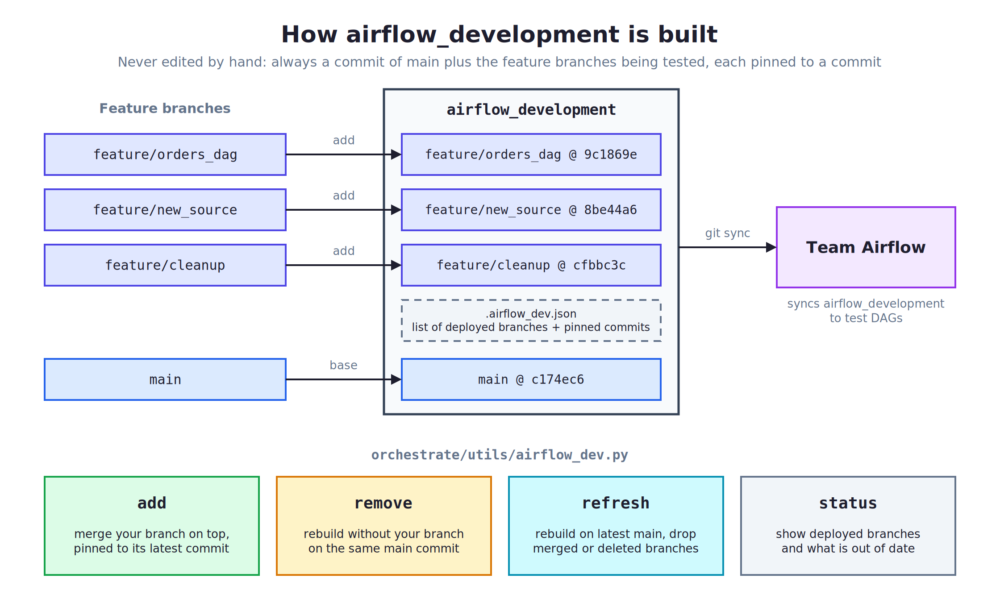

# Testing DAGs in Team Airflow (`airflow_development`)

Datacoves environments usually have two Airflow instances:

| Instance | Git branch | Purpose |
|---|---|---|
| Team Airflow (development) | `airflow_development` | Test DAGs before release |
| Production Airflow | `main` | Scheduled production runs |

To test a DAG in Team Airflow, your code has to be on `airflow_development`. People used to get it there by hand, either by merging their whole feature branch or by copying files. Over time the branch filled up with abandoned experiments and stale code, drifted away from `main`, and became hard to reason about.

`orchestrate/utils/airflow_dev.py` replaces that manual process.

## How it works

`airflow_development` is treated as generated output and is **never edited by hand**. It is always:

```
a commit of main  +  the feature branches currently being tested (each pinned to a commit)
```



<!-- Source: diagrams/airflow-development-branch.excalidraw. Edit it with the Excalidraw VS Code extension and re-export the PNG. -->


- The list of deployed branches is stored in `.airflow_dev.json` on `airflow_development` itself. No external service or CI is required.
- **Each branch is pinned to a commit.** New commits on your branch are not deployed until you run `add` again, so other people's rebuilds never ship your half-finished work.
- **You stay where you are.** The script works in a temporary git worktree, so your VS Code checkout and uncommitted changes are never touched.
- **Several people can run it at the same time.** Pushes are guarded and retried when two people deploy at once.

## Before you use Team Airflow: try My Airflow

[My Airflow](https://docs.datacoves.com/docs/how-tos/my_airflow) is a personal Airflow instance that follows whatever branch you have checked out in VS Code. Use it to iterate on DAG structure, import errors and basic configuration. Use Team Airflow for the final check, because it matches production: the Kubernetes executor, parallel tasks and notifications.

## Everyday workflow

Run these from anywhere in the repository, while on your feature branch.

### 1. Deploy your branch

```bash
orchestrate/utils/airflow_dev.py add
```

This:
1. Pushes your branch if it has unpushed commits. Uncommitted changes are **not** deployed, and you get a warning.
2. Checks that your branch is up to date with `main`.
3. Merges your branch into `airflow_development` and pushes it.

Team Airflow picks up the change on its next git sync.

### 2. Deploy new changes

Commit, then run the same command again:

```bash
orchestrate/utils/airflow_dev.py add
```

### 3. Remove your branch when you are done

```bash
orchestrate/utils/airflow_dev.py remove
```

`airflow_development` is rebuilt without your branch, on the same `main` commit, so no one else is affected. Branches that are merged into `main` or deleted are also cleaned up automatically at the next `refresh`.

### Check what is deployed

```bash
orchestrate/utils/airflow_dev.py status
```

```
airflow_development: based on main c174ec62 (3 commit(s) behind latest main)
3 deployed branch(es):
  feature/orders_dag      9c1869e4  Jane Doe    2026-09-20  up to date
  feature/new_source      8be44a68  John Smith  2026-09-22  newer commits not deployed, run 'add' again
  feature/cleanup         cfbbc3c2  Ana Lopez   2026-09-02  merged into main
```

All commands accept a branch name, e.g. `add feature/other_branch`, to act on a branch other than the current one.

## When `add` refuses

The script refuses rather than leaving `airflow_development` in a bad state. Each message tells you what to do.

### Your branch is behind `main`

```
❌ 'feature/orders_dag' is 4 commit(s) behind main. Update it first:
     git checkout feature/orders_dag && git pull origin main && git push
```

Bring `main` into your branch, resolve any conflicts there, and run `add` again. Conflicts are resolved in your feature branch, which is where they will need to be resolved before release anyway.

### Your branch conflicts with another deployed branch

```
❌ 'feature/orders_dag' conflicts with what is deployed on airflow_development.
   Conflicting files:
     - orchestrate/dags/daily_loan_run.py
   Deployed branches touching these files:
     - feature/loans_refactor (John Smith): orchestrate/dags/daily_loan_run.py
```

Two people are changing the same files. Talk to the owner listed: they can `remove` their branch when they are done, or you can agree on how to combine the changes.

### Your branch contains `airflow_development`

```
❌ 'feature/orders_dag' contains commits from airflow_development ...
```

Someone merged `airflow_development` into this branch. That would deploy other people's work and could carry it into `main`. Create a new branch from `main` and bring over only your own changes, for example with `git cherry-pick`.

**Never merge `airflow_development` into another branch.**

## Administration

### One-time setup

1. In your git provider, allow force pushes to `airflow_development`. The script rewrites the branch when it rebuilds it.
2. Make sure Team Airflow is configured to sync `airflow_development`.
3. Initialize the branch. This replaces its current contents with `main`:

   ```bash
   orchestrate/utils/airflow_dev.py reset --yes --backup
   ```

   `--backup` saves the current branch as `airflow_development__bkp_YYYYMMDD` first, so anything people had pushed there by hand can still be recovered.

4. Tell users to stop pushing to `airflow_development` directly and to use `add` instead.

### Periodic refresh (e.g. monthly)

```bash
orchestrate/utils/airflow_dev.py refresh --backup
```

This rebuilds `airflow_development` on the latest `main`, re-applies every deployed branch, and reports what changed:

```
✅ airflow_development rebuilt on latest main.
   dropped: feature/cleanup (merged into main)
   dropped: feature/old_idea (branch deleted)
⚠️  These branches no longer merge cleanly and were removed from airflow_development:
   - feature/orders_dag (Jane Doe): orchestrate/dags/daily_loan_run.py
   Owners should update their branch from main and run 'add' again.
```

`--backup` is optional and works the same as for `reset` (see below). It is useful here because branches that no longer merge cleanly are removed from `airflow_development`.

### Start over

```bash
orchestrate/utils/airflow_dev.py reset --yes --backup
```

This points `airflow_development` at `main` with nothing deployed.

With `--backup`, the current branch is first pushed to `airflow_development__bkp_YYYYMMDD` (e.g. `airflow_development__bkp_20260925`). Backups are never overwritten: a second backup on the same day gets a time suffix (`..._20260925_153216`). The backup is skipped if nothing is deployed. Delete old backup branches in your git provider when you no longer need them.

## Configuration

The defaults match the standard Datacoves setup. Override them with environment variables if your branch names differ:

| Variable | Default | Description |
|---|---|---|
| `AIRFLOW_DEV_BRANCH` | `airflow_development` | Branch Team Airflow syncs from |
| `AIRFLOW_DEV_BASE` | `main` | Branch the dev branch is built on |
| `AIRFLOW_DEV_REMOTE` | `origin` | Git remote |

## Limitations

- **Squash merges aren't detected as merged.** A branch squash-merged into `main` is dropped at `refresh` only if its remote branch was deleted (enable automatic branch deletion after merge in your git provider), or if it no longer merges cleanly.
- **A rebuild can change code under a running DAG.** `remove` and `refresh` rewrite `airflow_development`, so DAGs running in Team Airflow may pick up the new code mid-run.
- **Nothing stops a manual push.** The script cannot prevent someone from pushing directly to `airflow_development`. If that happens, run `refresh` to get the branch back to a known state.
