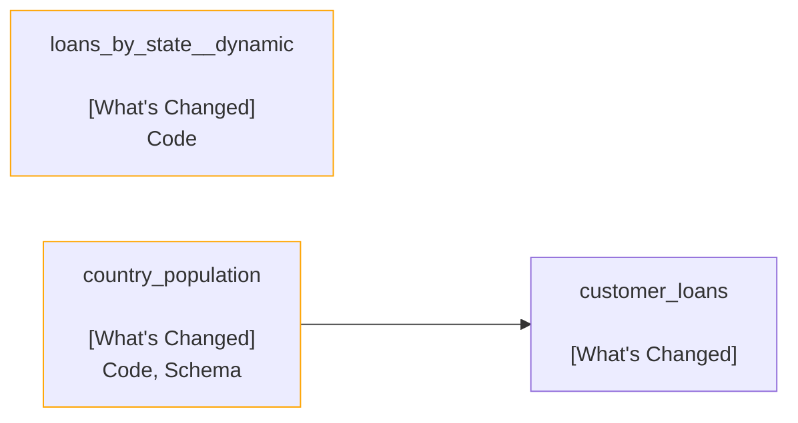

# Recce Summary
## Manifest Information
|        |Manifest            |Catalog             |
|--------|--------------------|--------------------|
|Base    |2024-11-19 14:07:31 |2024-11-02 17:42:54 |
|Current |2024-12-07 17:14:22 |2024-11-30 16:39:37 |

## Lineage Graph

## Checks Summary
|Checks Run|Data Mismatch Detected|
|----------|----------------------|
|     2    |           2          |

### Checks of Data Mismatch Detected
|Name           |Type           |Mismatched Nodes                                  |
|---------------|---------------|--------------------------------------------------|
|Row count diff |Row Count Diff |metadata                                          |
|Schema diff    |Schema Diff    |dbt_run_results, monitors_runs, and 28 more nodes |

# Recce Summary
## Manifest Information
|        |Manifest            |Catalog             |
|--------|--------------------|--------------------|
|Base    |2024-11-19 14:07:31 |2024-11-02 17:42:54 |
|Current |2024-12-07 17:53:30 |2024-12-07 17:53:45 |

## Lineage Graph

## Checks Summary
|Checks Run|Data Mismatch Detected|
|----------|----------------------|
|     2    |           1          |

### Checks of Data Mismatch Detected
|Name        |Type        |Mismatched Nodes   |
|------------|------------|-------------------|
|Schema diff |Schema Diff |country_population |

